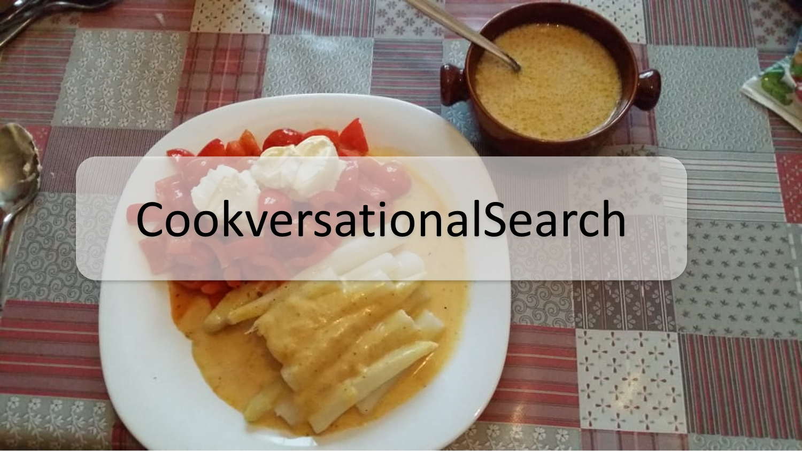

In this repository you find data that has been gathered when conducting in-situ experiments in a conversational cooking setting. These data include **transcripts**,**annotations** and **code** to analyse these data.

When you are here while reading our paper, you might have following questions:
## Where can I find the transcripts?
The raw transcripts are located in the ```transcripts``` folder. All experiments were conducted in Germany. Therefore, we provide the original german version as well as an english version transcribed with DeepL. Since we put much more effort in the transcription and annotation process compared to our workshop paper (=pilot study), we also provide the annotated data from that paper (see folder ```transcripts/workshop_paper```).
## Where is the information need taxonomy?
A visual representation can be found in the ```annotation``` folder. ```InformationNeedTaxonomy.svg``` is the file you are looking for.
## Where is the codebook?
A description of all information needs as well as examples for them are located in the ```annotation``` folder. ```annotation_schema_cookversational_search_german.xlsx``` is the german version, ```annotation_schema_cookversational_search.xlsx``` is the english one. The codebook from our pilot study is located in this folder, too.
## Where is the code for the machine learning experiments?
You find code for both the baseline models, the BERT based models and the results in the ```experiments``` folder.
## Is there a notebook that contains the statistical analyses?
Yes! ```Statistical Analysis.ipynb``` in the ```experiments```folder is the relevant file.
## Where is the *CookversationalSearch* dataset?
The fully annotated dataset with all information needs, german and english turns (translated with DeepL) is here: ```annotation/corpus/cookversational_search_dataset```

## Citation
```bibtex
@article{frummet2022whatcani,
  author       = {Alexander Frummet and
                  David Elsweiler and
                  Bernd Ludwig},
  title        = {{"What Can {I} Cook with these Ingredients?" - Understanding Cooking-Related
                  Information Needs in Conversational Search}},
  journal      = {{ACM} Trans. Inf. Syst.},
  volume       = {40},
  number       = {4},
  pages        = {81:1--81:32},
  year         = {2022},
  url          = {https://doi.org/10.1145/3498330},
}
```
